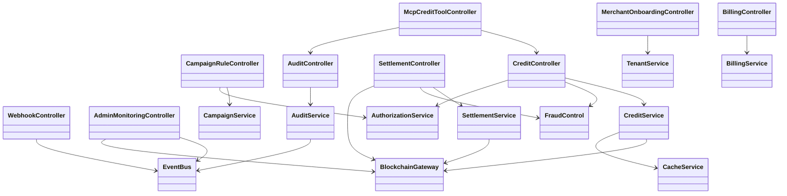

# Các lớp điều khiển Backend

Thiết kế này sử dụng mô hình UML boundary-control-entity. Các lớp điều khiển điều phối một ca sử dụng; chúng không sở hữu trạng thái lâu dài hoặc các quy tắc blockchain. Những quy tắc này thuộc về các thực thể miền, repository và các module Sui Move.

## Danh mục lớp

| Lớp điều khiển | Trách nhiệm chính | Thao tác chính |
|---|---|---|
| `MerchantOnboardingController` | Xử lý đăng ký merchant, thiết lập tenant và vòng đời thông tin xác thực | `registerMerchant()`, `createTenant()`, `rotateApiCredentials()` |
| `CampaignRuleController` | Kiểm tra và công bố các chiến dịch tích điểm/đổi điểm | `createRule()`, `updateRule()`, `publishCampaign()` |
| `CreditController` | Điều phối phát hành, đổi điểm và truy vấn số dư | `issueCredit()`, `redeemCredit()`, `getBalance()` |
| `SettlementController` | Tiếp nhận batch ngoại tuyến và gửi settlement PTB có tính lũy đẳng | `validateBatch()`, `settleBatch()`, `getSettlementStatus()` |
| `WebhookController` | Đăng ký listener và gửi các sự kiện giao dịch có chữ ký | `registerWebhook()`, `retryDelivery()`, `acknowledgeDelivery()` |
| `AuditController` | Tạo bản ghi kiểm toán có thể xác minh và lưu bằng chứng trên Walrus | `getHistory()`, `verifyRecord()`, `archiveEvidence()` |
| `McpCreditToolController` | Cung cấp các MCP tool an toàn cho AI Agent | `queryBalance()`, `queryHistory()`, `triggerCampaign()` |
| `AdminMonitoringController` | Tổng hợp tình trạng gateway, blockchain, tài trợ gas và tenant | `getPlatformHealth()`, `getTreasuryStatus()`, `getUsageMetrics()` |
| `BillingController` | Điều phối subscription Stripe, gói sử dụng và sự kiện webhook | `createSubscription()`, `processStripeEvent()`, `getInvoiceStatus()` |
| `FraudControl` | Áp dụng xác thực request, giới hạn tốc độ, chống phát lại và phát hiện bất thường | `verifySignature()`, `checkRateLimit()`, `detectAnomaly()` |

## Trách nhiệm chi tiết

### `MerchantOnboardingController`

- Yêu cầu platform administrator hoặc merchant owner đã được xác thực.
- Tạo tenant và các vai trò RBAC mặc định trong cùng một giao dịch ứng dụng.
- Tạo API key và chỉ lưu salted hash của API secret.
- Phát ra các sự kiện kiểm toán `TenantCreated` và `CredentialsRotated`.

### `CampaignRuleController`

- Kiểm tra tỷ lệ, thời hạn, tier và hệ số nhân có hợp lệ hay không.
- Xác minh tenant và quyền thao tác chiến dịch của bên gọi.
- Lưu bản chiếu rule off-chain có phiên bản, sau đó công bố rule đã được phê duyệt lên Move.
- Không cho sửa phiên bản đã công bố; mọi thay đổi phải tạo phiên bản mới.

### `CreditController`

- Đảm bảo cô lập tenant và tính lũy đẳng trước khi gọi blockchain gateway.
- Sử dụng `FraudControl` trước mọi thao tác tạo credit.
- Ủy quyền các bất biến về sở hữu, phát hành và đổi điểm cho Move contract.
- Chỉ ghi bản chiếu giao dịch vào PostgreSQL/Redis sau khi nhận được kết quả giao dịch có thể xác minh.

### `SettlementController`

- Tiếp nhận batch ID, merchant ID và các thao tác ngoại tuyến có chữ ký.
- Từ chối operation ID trùng lặp và chữ ký batch đã hết hạn.
- Chia các thao tác hợp lệ thành những Programmable Transaction Block có kích thước giới hạn.
- Trả về trạng thái cho từng thao tác để thiết bị POS chỉ retry các thao tác thất bại.

### `McpCreditToolController`

- Mặc định chỉ cung cấp tool đọc; tool thay đổi dữ liệu yêu cầu tenant authorization và xác nhận rõ ràng.
- Kiểm tra input MCP theo JSON schema và áp dụng cùng chính sách như REST client.
- Không bao giờ cung cấp API secret, private key, dữ liệu cá nhân thô hoặc transaction payload chưa ký.
- Trả về kết quả có cấu trúc và giới hạn kích thước, phù hợp với context window của AI Agent.

## Quan hệ giữa các lớp



## Hợp đồng điều khiển dùng chung

Các controller của tầng transport nên giữ ở mức mỏng và gọi application service thông qua request context dùng chung:

```ts
interface RequestContext {
  requestId: string;
  tenantId: string;
  actorId: string;
  roles: string[];
  idempotencyKey?: string;
}

interface ControlResult<T> {
  data: T;
  requestId: string;
  auditEventId: string;
}
```

Mọi control có thao tác thay đổi dữ liệu phải tuân theo trình tự sau:

1. Xác thực request và tạo `RequestContext`.
2. Kiểm tra quyền của actor đối với tenant và thao tác.
3. Kiểm tra request và idempotency key.
4. Chạy `FraudControl` cho các thao tác ảnh hưởng đến credit.
5. Gọi application service và blockchain gateway.
6. Lưu bản chiếu kết quả và phát ra sự kiện kiểm toán.
7. Trả về kết quả ổn định, bao gồm request ID và audit event ID.

## Quy tắc boundary và dependency

- Hono route handler là boundary class; chúng ánh xạ input HTTP/MCP thành control command và ánh xạ lỗi thành HTTP response.
- Control class có thể phụ thuộc vào application service, policy, repository, gateway và event publisher thông qua interface.
- Control class không được gọi trực tiếp client của PostgreSQL, Redis, Stripe, Walrus hoặc Sui SDK.
- `McpCreditToolController` phải tái sử dụng application control giống REST; không được tạo một cách triển khai credit thứ hai.
- Move contract là nguồn thẩm quyền cho các chuyển trạng thái on-chain. Backend TypeScript chỉ kiểm tra input và điều phối, không thể thay thế cơ chế cấp quyền của Move.
- Mọi control thay đổi dữ liệu phải có tính lũy đẳng và phát ra audit event chứa tenant, actor, operation, request và blockchain transaction ID.

## Kết quả lỗi đề xuất

| Điều kiện | Kết quả |
|---|---|
| HMAC hoặc API credential không hợp lệ | `401 Unauthorized` |
| Danh tính hợp lệ nhưng không có quyền trên tenant | `403 Forbidden` |
| Idempotency key trùng nhưng payload khác | `409 Conflict` |
| Bị từ chối do giới hạn tốc độ hoặc chính sách chống gian lận | `429 Too Many Requests` |
| Campaign hoặc credit command không hợp lệ | `422 Unprocessable Entity` |
| Dependency Sui/Stripe/Walrus không khả dụng | `503 Service Unavailable` |
